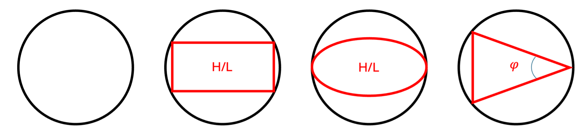

# Dataset guide

`Data/` contains the generated rock microstructures and the geometrical and hydraulic
properties reported in the accompanying *Scientific Data* article. White pixels denote
pore space and black pixels denote solid material in binary images.

The published archive is available at <https://doi.org/10.5281/zenodo.18807579>.

## Directory structure

```text
Data/
├── cemented/
│   └── 2D/
│       ├── blob_images/                 Binary and effective-pore-space images
│       └── simulation_results/          Geometrical and flow-property tables
└── random_packings/
    ├── 2D/
    │   ├── homogenous_diameter/         Equal particle diameter (historical spelling)
    │   │   ├── circle_data/             Random packing coordinates and images
    │   │   ├── circle_data_structured/  Regular-grid reference packings
    │   │   ├── simulation_results/
    │   │   └── simulation_results_structured/
    │   └── heterogeneous_diameter/      2D slices through 3D sphere packings
    │       ├── circle_data/
    │       └── simulation_results/
    └── 3D/
        ├── sphere_data/                  Particle-centre and radius data
        └── simulation_results/
```

> **Compatibility note:** `homogenous_diameter` is misspelled in the published directory
> schema. It is deliberately retained so paths remain compatible with the Zenodo release
> and paper.

## Archive handling

Particle coordinates are distributed in `pf_*.zip` archives grouped by packing fraction.
To extract every archive without overwriting existing files:

```bash
python tools/unpack_data.py
```

The extracted files are intentionally ignored by Git; the ZIP archives are the canonical
tracked copies.

## File naming

Packing fractions are written as fractions (`0.310`, not percentages). The principal
simulation-result conventions are:

```text
# 2D
Summary_{shape}_{packing_fraction}_extra_{shape_parameter}_beta_{rotation}.csv

# 3D
Summary_{shape}_{packing_fraction}_extra1_{shape_parameter_1}_extra2_{shape_parameter_2}_beta1_{rotation_1}_beta2_{rotation_2}.csv
```

`beta_r` means that individual grains have random orientations. Numeric beta values are
rotations in radians. The `extra` fields describe shape parameters:

- circle/sphere: `1` (no additional shape parameter);
- ellipse/rectangle: height-to-length ratio;
- 3D ellipsoid/box: the two axis ratios; and
- triangle/pyramid: the angular or aspect parameter used during inscription.

Individual realizations use the random seed as their model index, for example
`Model_1_pf_0.380...`.

<p align="center">
  
</p>

## Result columns

Not every table contains every column. The principal fields are:

| Column | Meaning |
| --- | --- |
| `Sample` | Realization/model identifier |
| `M0` | Pore fraction (porosity) |
| `M1` | Solid–pore interface measure (perimeter in 2D, area in 3D) |
| `M2` | Integrated mean curvature (3D only) |
| `M3` | Euler characteristic |
| `Tau` | Pore-space tortuosity |
| `Permeability` | Homogenized intrinsic permeability from Stokes flow |
| `Energy` | Microscale flow-energy quantity |
| `M1_Moose` | Interface measure evaluated in the MOOSE workflow |
| `M3_ana` | Analytical Euler-characteristic reference |

Cemented tables use `_ps` for values measured on the full PoreSpy image and `_eff_ps` for
values measured on its inlet-to-outlet connected pore space. Consult the article for the
normalization, boundary conditions, and validation methodology.

## Dataset scope

The published study varies packing fraction, particle geometry, orientation, size
distribution, and cemented-structure blobiness. Twenty-five random 2D configurations and
one structured reference are provided per applicable packing configuration. The paper
reports 82,075 individual 2D random-packing samples in total.

When adding data, preserve the naming pattern, include all generation parameters, and
store bulk coordinate files in a packing-fraction archive rather than committing extracted
copies.
