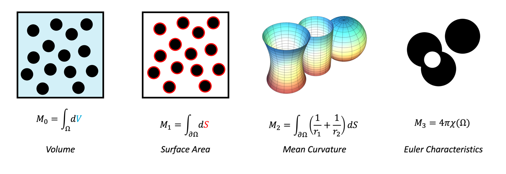

# ROCK MICROstructures and their MINKOWSKI functionals

## Description
RockMicro_Minkowskis is an open-source database of generated rock microstructures with computed [Minkowski functionals](https://en.wikipedia.org/wiki/Minkowski_functional) and corresponding Stokes flow simulation results.

Minkowski functionals are a set of measures used to quantify the geometric and topological features of a microstructure. The different Minkowski functionals are shown in the image below, and consist of the porosity, surface area, mean curvature (for 3D structures) and Euler characteristic

<figure>
  <p float="left">
    
  </p>
  <figcaption align="center">
  </figcaption>
</figure>


The dataset includes random packings of particles, which serve as a canonical model for studying pore-scale structures. Random packings are widely used in digital rock physics because they capture key aspects of granular media while allowing systematic control of the packing fraction (the ratio of solid to pore space).  

To extend the diversity of microstructures, we also generated the following shapes:  
- 2D: circles, rectangles, ellipses, triangles  
- 3D: spheres, boxes, pyramids  

These shapes were constructed by inscribing each particle within a circle or sphere, ensuring that the packings remain non-overlapping and directly comparable across different geometries.  

This approach enables a consistent study of how particle shape, in addition to packing density, influences both Minkowski functionals and macroscopic transport properties such as permeability and tortuosity.  d

The dataset is designed to explore the relationship between microstructural features and macroscopic transport properties, with controlled variation in:  
- Particle shape: circles, rectangles, ellipses, triangles (2D), pyramids and boxes (3D)  
- Packing fraction: systematically varied to capture pore-scale transitions  
- Connectivity: cemented configurations are included to study reduced connectivity

<figure>
  <p float="left">
    
     
  </p>
  <figcaption align="center">
    Example microstructures: (left) random packing of circular particles, (right) cemented configuration.
  </figcaption>
</figure>
 
 
This repository contains both the data and the scripts used for generation and analysis.

## Dataset structure
```bash
RockMicro_Minkowskis/
│
├── data/                                      # Main dataset
│   ├── cemented/                              # Cemented configurations 
│       ├── 2D/                                # In two dimensions
│           ├── blob_images/                   # Data to (re)create the blobbed images
│           └── simulation_results/            # The results of the simulations of the hydraulic properties
│
│   └── random_packings/                       # Random particle packings (all shapes, packing fractions)
│       ├── 2D/                                # In two dimensions
│           ├── heterogeneous_diameter/        # Varying diameter over the structure
│               ├── Circle_data/               # Data of the coordinates and radius of a random grid]
│               └── simulation_results/  
│      
│           ├── homogeneous_diameter/          # Constant diameter over the structure
│               ├── Circle_data/
│               ├── circle_data_structured/    # Data of the coordinates and radius of the structured grid
│               └── simulation_results/        
│
│       └── 3D/                                # In three dimensions
│               ├── simulation_results/        
│               └── Sphere_data/               # Data of the hydraulic properties related to the circle data
│
├── scripts/                                   # Python scripts for geometry generation and analysis
│   ├── meshing.py
│   ├── microstructures.py
│   └── postprocessing.py
│
├── Simulation_files/                          # Example input files for Stokes flow simulations in MOOSE
│   ├── stokes_input.i
│   └── mesh_example.e
│
└── README.md                                  # This file
```

## Software requirements
The Python scripts rely on the following packages and dependencies:  
- [PoreSpy](https://porespy.org/) – microstructure generation and analysis  
- [Gmsh](https://gmsh.info/) – meshing of generated geometries  
- [OpenMC](https://openmc.org/) – (used for geometry sampling / utilities)
- [tau] 
- [NumPy](https://numpy.org/) and [pandas](https://pandas.pydata.org/) – data handling  

For flow simulations, we use the [MOOSE framework](https://mooseframework.inl.gov/) to solve the incompressible Stokes equations on the generated meshes.  
Please, run the setup.sh bash file to unpack the zip files and create an .gitignore

## Contributing
Currently, the main contributors are:

- [S. Zwarts](https://scholar.google.com/citations?hl=en&user=tFDIX40AAAAJ)
- [W. Lindqwister](https://scholar.google.com/citations?view_op=search_authors&mauthors=winston+lindqwister&hl=en&oi=ao)
- [M. Lesueur](https://scholar.google.com/citations?hl=en&user=Rt6zNgkAAAAJ)
