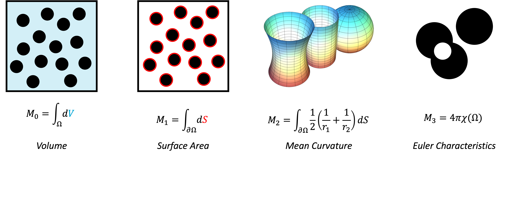

# RockMicro Minkowski-functionals dataset

[](https://doi.org/10.1038/s41597-026-07321-0)
[](https://doi.org/10.5281/zenodo.18807579)
[](https://www.python.org/)
[](LICENSE)

An open dataset and Python toolkit for studying relationships between idealized rock
microstructures, Minkowski functionals, and hydraulic transport properties. This is the
companion repository for **“Database of Generated Rock Microstructures and their
Computed Geometrical and Hydraulic Properties”** (Zwarts, Lindqwister, and Lesueur,
*Scientific Data*, 2026).

<p align="center">
  
</p>

## What is included

The dataset combines controlled synthetic geometries with steady incompressible Stokes-flow
results. It contains:

- 2D random packings with circular, elliptical, rectangular, and triangular grains;
- homogeneous and heterogeneous particle-size distributions;
- aligned and random grain orientations;
- 3D sphere, ellipsoid, box, and pyramid packings;
- cemented, channel-like microstructures generated with PoreSpy; and
- porosity, interface measure, curvature (3D), Euler characteristic, tortuosity,
  permeability, and flow-energy results.

The controlled changes in packing fraction, shape, aspect ratio, and orientation broaden
the sampled Minkowski-functional space and help separate their effects on transport.

<p align="center">
  
  
</p>

## Quick start

The code used for the paper targets Python 3.12. From the repository root:

```bash
bash setup.sh
source .venv/bin/activate
python examples/cemented.py
```

Generated files go to `outputs/`, which Git ignores. To include Gmsh, PyVista, VTK, and
TauFactor, use `bash setup.sh --all`.

For the complete research environment, including OpenMC, use Conda or Mamba:

```bash
mamba env create -f environment.yml
mamba activate rockmicro
```

OpenMC is kept in the Conda environment because its official distribution includes
compiled libraries that are not installed by this project's normal `pip` workflow.

### Unpack the coordinate archives

The canonical particle-coordinate data are stored as ZIP archives. Extract them only when
needed (the full unpacked dataset is large):

```bash
python tools/unpack_data.py
```

The command skips archives whose files are already present. Use `--force` to overwrite
previously extracted content.

## Common workflows

Generate a small 2D packing:

```bash
python examples/random_packing.py
python examples/random_packing.py --mesh  # requires the mesh extra
```

Compute properties for a binary image, where white is pore space and black is solid:

```python
from rockmicro.postprocessing import compute_properties

m0, m1, m3, tortuosity = compute_properties("path/to/microstructure.png")
```

The files in `Simulation_files/` are templates for MOOSE. MOOSE itself is external
simulation software and is not installed into the Python environment. Configure a valid
MOOSE executable before using `rockmicro.moose.run_simulation_image` or
`run_simulation_mesh`.

## Repository layout

```text
.
├── Data/                 Published microstructures and simulation results
├── Simulation_files/     MOOSE input files and renderable templates
├── README_images/        Figures used by the documentation
├── examples/             Small, runnable workflow examples
├── src/rockmicro/        Installable Python package
├── tests/                Fast package and template tests
├── tools/                Dataset maintenance utilities
├── environment.yml       Full Conda environment (including OpenMC)
└── pyproject.toml        Python package metadata and pip dependencies
```

The `Data/` layout is intentionally preserved to remain compatible with the published
dataset and paper. Its historical directory name `homogenous_diameter` is therefore not
renamed. See [Data/README.md](Data/README.md) for the complete schema and column guide.

## Reproducibility and development

```bash
pytest
ruff check src tests examples tools
```

The continuous-integration workflow runs these checks with Python 3.12. Contributions are
welcome; please read [CONTRIBUTING.md](CONTRIBUTING.md) before adding generated data.

## Citation

If you use the dataset or code, cite both the article and archived dataset:

> Zwarts, S., Lindqwister, W., & Lesueur, M. (2026). Database of Generated Rock
> Microstructures and their Computed Geometrical and Hydraulic Properties.
> *Scientific Data*. <https://doi.org/10.1038/s41597-026-07321-0>

> Zwarts, S. (2026). RockMicro Minkowskis: First release of database. Zenodo.
> <https://doi.org/10.5281/zenodo.18807579>

Machine-readable citation metadata are provided in [CITATION.cff](CITATION.cff).

## License

The repository is distributed under the [Creative Commons Attribution 4.0 International
license](LICENSE). Please retain attribution when reusing the data or code.

## Authors

- [Sijmen Zwarts](https://scholar.google.com/citations?user=tFDIX40AAAAJ)
- [Winston Lindqwister](https://scholar.google.com/citations?view_op=search_authors&mauthors=winston+lindqwister)
- [Martin Lesueur](https://scholar.google.com/citations?user=Rt6zNgkAAAAJ)
